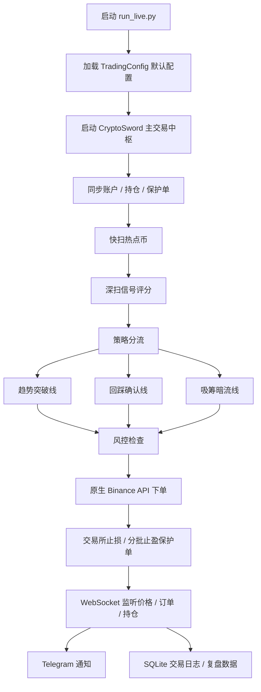

# ⚔️ Crypto Sword / 宙斯交易中枢

> 面向 Binance USDT 永续合约的自动化交易中枢：自动扫描热点币、识别信号、风控开仓、挂保护单、监听成交、Telegram 通知、复盘记录。

这套系统的目标不是“无脑追涨”，而是把 **热点扫描 + OI/Funding + 均线确认 + 风控执行 + 交易所保护单 + WS 同步** 串成一条尽量短延迟、可复盘、可继续进化的实盘链路。

---

## 🚀 默认启动

服务器上默认直接运行：

```bash
python3 run_live.py
```

后台运行：

```bash
nohup python3 run_live.py > /root/.hermes/logs/crypto_sword.log 2>&1 &
```

查看实时日志：

```bash
tail -f /root/.hermes/logs/crypto_sword.log
```

停止程序：

```bash
pkill -f "crypto_sword.py|run_live.py"
```

> ✅ 日常建议使用 `run_live.py`。它会加载当前项目内置的默认实盘配置，避免每次启动都写一长串参数。

---

## 🧠 系统流程



---

## 🏛️ 核心模块

| 模块 | 作用 |
|---|---|
| `run_live.py` | 🟢 简化启动入口，默认实盘运行。 |
| `crypto_sword.py` | ⚔️ 主程序入口，负责创建交易中枢、解析完整配置、启动循环。 |
| `core/` | 🧩 主交易引擎拆分层，包含扫描、确认、执行、同步、周期调度。 |
| `core/models.py` | ⚙️ 默认参数中心，绝大多数策略和风控默认值都在 `TradingConfig`。 |
| `signal_enhancer.py` | 📈 K 线、趋势、均线、信号增强分析。 |
| `risk_manager.py` | 🛡️ 仓位、止损、风险评分、敞口控制。 |
| `binance_api_client.py` | 🔌 原生 Binance REST API 客户端。 |
| `binance_websocket.py` | ⚡ WebSocket 行情、订单、账户监听。 |
| `binance_trading_executor.py` | 📤 下单、保护单、分批止盈、交易所订单执行。 |
| `oi_funding_scanner.py` | 🌊 OI / Funding 数据增强，用于识别资金费率和未平仓合约变化。 |
| `token_anomaly_radar.py` | 📡 妖币/异动币扫描雷达。 |
| `telegram_notifier.py` | 📲 Telegram 通知模板。 |
| `trade_logger.py` | 🧾 SQLite 交易记录、日报、复盘数据。 |
| `feature_store/` | 🧠 交易特征和复盘原因沉淀，方便后续训练或策略分析。 |

---

## ⚙️ 参数在哪里调？

默认不建议在启动命令里写一堆参数。

如果要改策略、风控、扫描速度，优先修改：

```text
core/models.py
```

重点看：

```text
TradingConfig
```

这里控制：

- 💰 杠杆、单笔风险、最大持仓数
- 🛡️ 止损、止盈、追踪止损、连亏暂停
- 📡 快扫 / 深扫间隔、扫描数量、并发扫描数
- 🌊 OI / Funding 加分逻辑
- 🎯 趋势突破、回踩确认、吸筹暗流入场条件
- 📲 每日复盘、Telegram 通知要求

如果只是想临时测试完整参数能力，可以看：

```bash
python3 crypto_sword.py --help
```

但正式服务器运行建议继续保持：

```bash
python3 run_live.py
```

---

## 📲 Telegram 通知

系统会自动推送：

- ⚔️ 启动通知
- 🟢 开仓成功
- 🛡️ 保护单确认
- 🎯 分批止盈成交
- 🔴 平仓完成
- 📊 持仓汇总
- 📡 妖币扫描报告
- ❌ 开仓失败 / 异常通知
- 🧾 每日复盘

通知模板统一在：

```text
telegram_notifier.py
```

Telegram 配置通常放在：

```text
config/telegram.json
```

或服务器环境变量中。

---

## 📂 数据和日志

服务器常用路径：

```text
/root/.hermes/logs/crypto_sword.log
/root/.hermes/logs/trade_log.db
```

说明：

- `crypto_sword.log`：运行日志，排查扫描、下单、WS、异常。
- `trade_log.db`：SQLite 交易数据库，保存开仓、平仓、盈亏、复盘原因。
- `feature_store/`：交易特征沉淀，可作为后续策略训练和复盘样本。

查看日志：

```bash
tail -f /root/.hermes/logs/crypto_sword.log
```

查看进程：

```bash
ps -ef | grep -E "crypto_sword.py|run_live.py"
```

---

## 🧬 当前策略思想

系统目前不是单一策略，而是多线并行：

- 🚀 **趋势突破线**：热点币继续放量、OI 扩张、趋势延续时，允许更快入场。
- 🎯 **回踩确认线**：发现热点后进入观察池，等待回踩和均线确认，减少追高。
- 🌊 **吸筹暗流线**：涨幅不夸张但 OI、成交量、资金费率出现异动时提前观察。
- 🛡️ **风控守门**：仓位、余额、敞口、流动性、滑点、连亏熔断统一检查。
- ⚡ **WS 驱动**：用 WebSocket 尽量减少 REST 轮询，提升订单和持仓同步速度。

---

## 🛡️ 风控原则

系统会尽量做到：

- 开仓后立刻挂交易所保护单。
- 止损和分批止盈尽量由交易所执行，不只依赖本地轮询。
- TP1 后可推进保本，减少盈利单变亏损。
- 连续亏损后暂停新开仓，避免情绪化连续扫损。
- 裸仓保护不完整时会通知并限制风险。

> ⚠️ 实盘仍然有风险。交易所延迟、极端插针、流动性不足、API 异常都可能造成非预期结果。

---

## 🔄 服务器更新流程

```bash
cd /root/.hermes/scripts
git pull
pkill -f "crypto_sword.py|run_live.py"
nohup python3 run_live.py > /root/.hermes/logs/crypto_sword.log 2>&1 &
tail -f /root/.hermes/logs/crypto_sword.log
```

---

## 🧪 本地检查

提交前建议跑：

```bash
python -m py_compile crypto_sword.py
```

更完整的方式是编译全部 Python 文件，确保没有语法错误。

---

## 👑 给宙斯的操作口诀

日常只记这几句就够：

```bash
cd /root/.hermes/scripts
git pull
pkill -f "crypto_sword.py|run_live.py"
nohup python3 run_live.py > /root/.hermes/logs/crypto_sword.log 2>&1 &
tail -f /root/.hermes/logs/crypto_sword.log
```

参数不要塞启动命令里，要调就改：

```text
core/models.py -> TradingConfig
```

交易结果和复盘看：

```text
/root/.hermes/logs/trade_log.db
```

日志异常看：

```text
/root/.hermes/logs/crypto_sword.log
```

---

## ⚠️ 免责声明

本项目用于自动化交易研究和个人实盘辅助。任何策略都不保证盈利，请根据账户规模控制风险，尤其注意高杠杆、小市值币、极端行情和 API 异常。
