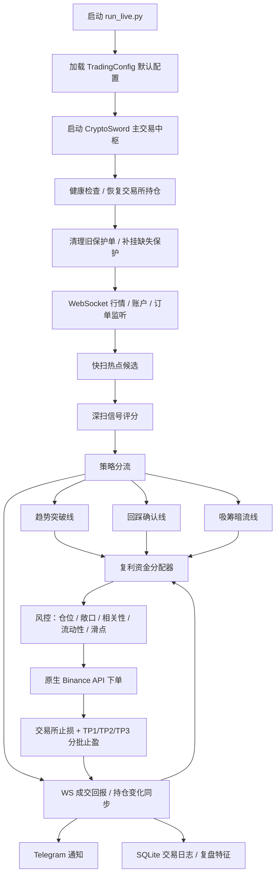

# ⚔️ Crypto Sword / 宙斯交易中枢

> 面向 Binance USDT 永续合约的自动化交易中枢：扫描热点币、识别信号、资金分配、风控开仓、交易所保护单、WebSocket 同步、Telegram 通知、SQLite 复盘记录。

这套系统不是“看到上涨就追”，而是把 **热点扫描 + OI/Funding + 均线/动量确认 + 复利资金分配 + 交易所止损/分批止盈 + WS 成交同步** 串成一条尽量短延迟、可复盘、可继续进化的实盘链路。

---

## 🚀 默认启动

服务器日常只建议运行：

```bash
python3 run_live.py
```

后台运行：

```bash
nohup python3 run_live.py > /root/.hermes/logs/crypto_sword.log 2>&1 &
```

查看实时日志：

```bash
tail -f /root/.hermes/logs/crypto_sword.log
```

停止程序：

```bash
pkill -f "crypto_sword.py|run_live.py"
```

更新并重启：

```bash
cd /root/.hermes/scripts
git pull
pkill -f "crypto_sword.py|run_live.py"
nohup python3 run_live.py > /root/.hermes/logs/crypto_sword.log 2>&1 &
tail -f /root/.hermes/logs/crypto_sword.log
```

> ✅ 日常使用 `run_live.py`，不要把一长串参数塞进启动命令。要长期调参，改 `core/models.py -> TradingConfig`。

---

## ⚙️ 当前默认参数

| 参数 | 默认值 | 说明 |
|---|---:|---|
| 最大持仓 | `3` | 小资金优先控制回撤，不再默认开 5-10 个仓位。 |
| 基础杠杆 | `5x` | 小资金防守版默认不再自动升到 `8x/10x`。 |
| 单笔基础风险 | `0.6%` | 资金分配器会在 `0.2%-0.9%` 区间动态调整。 |
| 基础止损 | `6.0%` | 实际会按策略线、ATR、保护单规则调整。 |
| 基础止盈 | `22.0% ROI` | 实际下单会转换为价格目标，并分批止盈。 |
| 深扫间隔 | `120s` | 用于完整信号评分。 |
| 快扫间隔 | `10s` | 用于快速更新 WebSocket 热点候选。 |
| 深扫数量 | `Top 50 / WS热榜 24` | REST 回退扫描前 50；WS 正常时优先深扫最热 24 个，提高速度。 |
| 单仓名义上限 | `25%` | 按余额和风险预算限制仓位。 |
| 总敞口上限 | `120%` | `run_live.py` 默认值，用于防止小资金过度铺仓。 |
| 日内亏损熔断 | `关闭` | `max_daily_loss_pct=0`，目前通过资金分配器降档防守。 |

---

## 🧠 系统流程



---

## 🏛️ 核心模块

| 模块 | 作用 |
|---|---|
| `run_live.py` | 🟢 简化启动入口，加载当前推荐默认值。 |
| `crypto_sword.py` | ⚔️ 主程序入口，负责完整参数、初始化和主循环。 |
| `core/` | 🧩 主交易引擎拆分层：扫描、确认、执行、同步、周期调度。 |
| `core/models.py` | ⚙️ 默认参数中心，重点看 `TradingConfig`。 |
| `services/capital_allocator.py` | 🏦 复利资金分配器，决定是否开仓、用多少风险、是否临时升杠杆。 |
| `services/order_service.py` | 📤 订单服务封装，包含保护单撤销和补挂。 |
| `services/risk_service.py` | 🛡️ 风控服务封装，连接 `risk_manager.py`。 |
| `binance_api_client.py` | 🔌 原生 Binance REST API 客户端，不再依赖 `binance-cli` 下单。 |
| `binance_websocket.py` | ⚡ WebSocket 行情、订单、账户监听。 |
| `binance_trading_executor.py` | ⚙️ 实际下单、杠杆、止损、分批止盈执行。 |
| `signal_enhancer.py` | 📈 K 线、均线、趋势、成交量、信号增强分析。 |
| `oi_funding_scanner.py` | 🌊 OI / Funding 数据增强。 |
| `token_anomaly_radar.py` | 📡 妖币/异动雷达。 |
| `telegram_notifier.py` | 📲 Telegram 通知模板。 |
| `trade_logger.py` | 🧾 SQLite 交易记录、日报、复盘数据。 |
| `feature_store/` | 🧠 交易特征、开仓保护、复盘原因沉淀。 |

---

## 🏦 复利资金分配器

最新主链已经接入 `CapitalAllocator`。它不是单纯加仓，而是每笔信号开仓前做一次资金决策：

- `期望盈亏比`：预计分批止盈收益必须覆盖止损风险，默认最低 `1.45R`，并扣除预估手续费/滑点。
- `风险动态化`：基础风险 `0.6%`，根据行情和日内表现调整到 `0.2%-0.9%`。
- `杠杆控制`：默认 `5x`，小资金防守版不再自动升到 `8x/10x`。
- `回撤降档`：日内表现弱、胜率/PF 低、回撤扩大时自动进入防守。
- `盈利锁仓`：日内盈利达到阈值后，部分利润不再参与下一笔风险计算。
- `通知可见`：开仓通知会显示资金档位、EV、盈利锁仓等信息。

常见资金档位：

| 档位 | 说明 |
|---|---|
| 标准复利 | 正常交易状态。 |
| 防守复利 | 日内亏损或胜率/PF 偏弱，自动降风险。 |
| 深度防守 | 日内回撤较大，只保留更小风险。 |
| 进攻复利 | 强趋势信号且日内未回撤时，才小幅提高风险和仓位上限。 |
| 精英强攻 | 极强趋势 + OI 合理 + 盈亏比优秀，只小幅提高风险，不主动升杠杆。 |

---

## 🧬 当前策略思想

系统目前是多线并行：

- 🚀 **趋势突破线**：热点币放量、OI 扩张、趋势延续时快速入场。
- 🎯 **回踩确认线**：热点首次出现后进入观察池，等待回踩和重站确认。
- 🟡 **均线二启线**：冲高后回踩守住 MA20，再重新站上 MA5 时入场，专门处理“第一次没追、第二次启动可惜”的走势。
- 🌊 **吸筹暗流线**：涨幅不夸张，但 OI、成交量、资金费率出现异动时提前观察。
- 🧊 **短线冲高过滤**：避免刚冲高插针后立刻追入。
- 🛡️ **风控守门**：仓位、敞口、相关性、流动性、滑点、保护单全部检查。
- ⚡ **WS 驱动同步**：订单成交、分批止盈、持仓变化优先通过 WebSocket 处理。
- 🛰️ **WS 热度榜**：全市场 miniTicker 维护 1m/3m/5m 短线速度，热榜变化会提前触发深扫。

---

## 🛡️ 止盈止损逻辑

开仓成功后，系统会尽量立即挂交易所保护单：

- 止损：交易所 `STOP_MARKET` 保护单。
- 止盈：交易所 `TAKE_PROFIT_MARKET`，默认 TP1/TP2/TP3 三档。
- TP1 成交：发送分批止盈通知，剩余仓位继续等待 TP2/TP3。
- TP 后保本：系统会尝试把止损移动到接近保本位置，避免盈利单转大亏。
- 全部平仓：以交易所真实成交/持仓同步为准，通知会显示价格涨幅和实际 ROI。

> ⚠️ 保护单是实盘生命线。若通知出现“裸仓风险”或“保护单不完整”，必须优先处理。

---

## 📲 Telegram 通知

系统会自动推送：

- ⚔️ 启动通知
- 🟢 开仓成功
- 🛡️ 保护单确认
- 🎯 分批止盈成交
- 🔴 平仓完成
- 📊 持仓汇总
- 📡 妖币扫描报告 / 候选跟踪
- 🧭 雷达通知
- ❌ 开仓失败 / 异常通知
- 🧾 每日复盘

通知模板统一在：

```text
telegram_notifier.py
```

Telegram 配置通常放在：

```text
config/telegram.json
```

或服务器环境变量中。

---

## 📂 数据和日志

服务器常用路径：

```text
/root/.hermes/logs/crypto_sword.log
/root/.hermes/logs/trade_log.db
```

说明：

- `crypto_sword.log`：运行日志，排查扫描、下单、WS、异常。
- `trade_log.db`：SQLite 交易数据库，保存开仓、平仓、盈亏、复盘原因。
- `feature_store/`：交易特征沉淀，可作为后续策略训练和复盘样本。

查看日志：

```bash
tail -f /root/.hermes/logs/crypto_sword.log
```

查看进程：

```bash
ps -ef | grep -E "crypto_sword.py|run_live.py"
```

查看数据库示例：

```bash
sqlite3 /root/.hermes/logs/trade_log.db
```

进入 SQLite 后可执行：

```sql
.tables
SELECT symbol, side, entry_price, exit_price, pnl, pnl_pct, exit_reason, entry_time, exit_time
FROM trades
ORDER BY id DESC
LIMIT 20;
```

---

## ⚙️ 参数在哪里调？

长期默认参数优先改：

```text
core/models.py -> TradingConfig
```

常调区域：

- 💰 `leverage`：基础杠杆，默认 `5`。
- 🧮 `risk_per_trade_pct`：基础单笔风险，默认 `0.6`。
- 🧩 `max_open_positions`：最大持仓数，默认 `3`。
- 🛡️ `stop_loss_pct`：基础止损，默认 `6.0`。
- 🎯 `take_profit_pct`：基础止盈 ROI，默认 `22.0`。
- 🏦 `capital_*`：复利资金分配器参数。
- 📡 `scan_interval_sec` / `fast_scan_interval_sec`：深扫/快扫间隔。
- 🌊 `oi_funding_*`：OI/Funding 加分逻辑。
- 🚀 `momentum_*` / `accumulation_*`：趋势和吸筹入场门槛。

临时查看完整命令参数：

```bash
python3 crypto_sword.py --help
```

但正式服务器运行仍建议：

```bash
python3 run_live.py
```

---

## 🧪 本地检查

提交前建议至少跑：

```bash
python -m py_compile crypto_sword.py
```

完整检查所有 Python 文件：

```bash
python - <<'PY'
import pathlib, py_compile
for path in pathlib.Path('.').rglob('*.py'):
    py_compile.compile(str(path), doraise=True)
print('PY_COMPILE_OK')
PY
```

---

## 👑 给宙斯的操作口诀

日常启动：

```bash
cd /root/.hermes/scripts
python3 run_live.py
```

后台实盘：

```bash
cd /root/.hermes/scripts
nohup python3 run_live.py > /root/.hermes/logs/crypto_sword.log 2>&1 &
tail -f /root/.hermes/logs/crypto_sword.log
```

更新重启：

```bash
cd /root/.hermes/scripts
git pull
pkill -f "crypto_sword.py|run_live.py"
nohup python3 run_live.py > /root/.hermes/logs/crypto_sword.log 2>&1 &
tail -f /root/.hermes/logs/crypto_sword.log
```

调参数：

```text
core/models.py -> TradingConfig
```

看交易复盘：

```text
/root/.hermes/logs/trade_log.db
```

看运行异常：

```text
/root/.hermes/logs/crypto_sword.log
```

---

## ⚠️ 免责声明

本项目用于自动化交易研究和个人实盘辅助。任何策略都不保证盈利。小资金、高杠杆、小市值币、极端行情、交易所延迟、API 异常都可能造成损失。默认 3 仓和资金分配器是为了降低风险，不代表可以忽视仓位管理。
