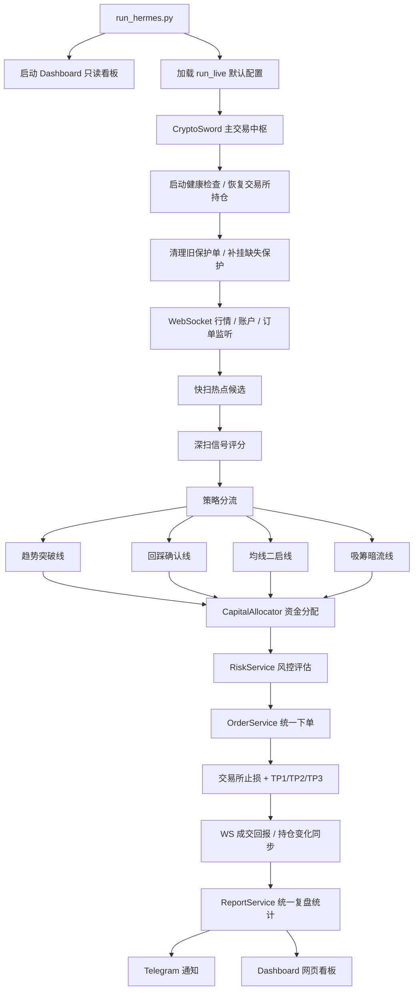

# ⚔️ Crypto Sword / 宙斯交易中枢

> 面向 Binance USDT 永续合约的自动化交易中枢：热点扫描、信号确认、复利资金分配、风控开仓、交易所保护单、WebSocket 同步、Telegram 通知、SQLite 复盘、只读网页看板。

系统现在已经完成 P0-P3 架构精简：主交易链、交易所访问层、通知模板、网页看板、复盘统计都拆成独立服务。日常使用不需要记长参数，一条命令即可启动主程序和网页。

---

## 🚀 推荐启动

服务器日常推荐：

```bash
cd /root/.hermes/scripts
python3 run_hermes.py
```

后台运行：

```bash
cd /root/.hermes/scripts
nohup python3 run_hermes.py > /root/.hermes/logs/crypto_sword.log 2>&1 &
tail -f /root/.hermes/logs/crypto_sword.log
```

`run_hermes.py` 会同时启动：

- ⚔️ 主交易中枢：扫描、开仓、保护单、平仓、复盘。
- 🖥️ 只读网页看板：默认 `127.0.0.1:8787`，不需要 nginx，不暴露公网。

只运行交易、不启动网页：

```bash
python3 run_hermes.py --no-dashboard
```

只运行旧的轻量交易入口：

```bash
python3 run_live.py
```

---

## 🖥️ 打开网页看板

看板默认只监听服务器本机：

```text
http://127.0.0.1:8787
```

本地电脑通过 SSH 隧道访问：

```bash
ssh -L 8787:127.0.0.1:8787 root@你的服务器IP
```

然后浏览器打开：

```text
http://127.0.0.1:8787
```

看板能力：

- ⚡ 自动读取 Binance 余额、持仓、未实现盈亏。
- 🛡️ 显示保护单数量，辅助排查止损/止盈是否完整。
- 📊 显示今日、近 7 天、近 30 天统计。
- 🧾 最近完整交易按流水号聚合，分批 TP 只算一笔。
- 📥 支持 CSV 下载，方便复盘。
- 🕒 统计以 Binance UTC 为准，同时显示 UTC+8 辅助窗口。

---

## 🛑 停止和重启

查看进程：

```bash
ps -ef | grep -E "run_hermes.py|run_live.py|crypto_sword.py|dashboard_server.py"
```

停止：

```bash
pkill -f "run_hermes.py|run_live.py|crypto_sword.py|dashboard_server.py"
```

更新并重启：

```bash
cd /root/.hermes/scripts
git pull
pkill -f "run_hermes.py|run_live.py|crypto_sword.py|dashboard_server.py"
nohup python3 run_hermes.py > /root/.hermes/logs/crypto_sword.log 2>&1 &
tail -f /root/.hermes/logs/crypto_sword.log
```

---

## ⚙️ 参数在哪里调？

日常不要在启动命令里塞一大串参数。

长期默认参数优先改：

```text
core/models.py -> TradingConfig
```

启动入口默认参数在：

```text
run_live.py -> build_parser()
run_live.py -> build_config()
```

统一启动入口在：

```text
run_hermes.py
```

常调参数：

| 参数 | 当前启动默认值 | 说明 |
|---|---:|---|
| 最大持仓 | `3` | 小资金更适合少仓位，避免亏损扩散。 |
| 基础杠杆 | `5x` | 不默认追求高杠杆。 |
| 单笔基础风险 | `0.6%` | 后续由资金分配器按表现动态调节。 |
| 基础止损 | `12%` | 实际会被策略线、ATR、保护逻辑转换为具体价格。 |
| 基础止盈 | `35% ROI` | 实际会转换为价格目标，并分批 TP。 |
| 最大单仓名义 | `12%` | 控制单笔仓位占用，500U 默认更偏稳定复利。 |
| 总敞口上限 | `90%` | 固定敞口，避免妖币同跌时铺太满。 |
| 最大持仓 | `3` | 默认只保留 3 个并发机会。 |
| 每轮最多开仓 | `1` | 每轮只执行最强信号，降低噪音交易。 |
| 深扫数量 | `Top 30` | 深度评分范围。 |
| 深扫间隔 | `300s` | 完整评分周期。 |
| 快扫间隔 | `60s` | 热点候选刷新周期。 |
| 每日限单 | 默认关闭 | 不再按日内次数拦截；可用 `--daily-entry-limit` 手动开启。 |

查看全部启动参数：

```bash
python3 run_hermes.py --help
```

---

## 🧠 系统流程


```mermaid
flowchart TD
    A["run_hermes.py"] --> B["启动 Dashboard 只读看板"]
    A --> C["加载 run_live 默认配置"]
    C --> D["CryptoSword 主交易中枢"]
    D --> E["启动健康检查 / 恢复交易所持仓"]
    E --> F["清理旧保护单 / 补挂缺失保护"]
    F --> G["WebSocket 行情 / 账户 / 订单监听"]
    G --> H["快扫热点候选"]
    H --> I["深扫信号评分"]
    I --> J["策略分流"]
    J --> K["趋势突破线"]
    J --> L["回踩确认线"]
    J --> M["均线二启线"]
    J --> N["吸筹暗流线"]
    K --> O["CapitalAllocator 资金分配"]
    L --> O
    M --> O
    N --> O
    O --> P["RiskService 风控评估"]
    P --> Q["OrderService 统一下单"]
    Q --> R["交易所止损 + TP1/TP2/TP3"]
    R --> S["WS 成交回报 / 持仓变化同步"]
    S --> T["ReportService 统一复盘统计"]
    T --> U["Telegram 通知"]
    T --> V["Dashboard 网页看板"]
```

---

## 🏛️ 当前架构

| 模块 | 作用 |
|---|---|
| `run_hermes.py` | 👑 统一启动入口：主交易程序 + 只读网页。 |
| `run_live.py` | 🟢 只启动主交易程序的轻量入口。 |
| `crypto_sword.py` | ⚔️ 运行时编排器，负责初始化和主循环。 |
| `core/` | 🧩 交易引擎核心 mixin：扫描、确认、执行、同步、周期调度。 |
| `core/execution_mixin.py` | 📌 只保留 `execute_entry()` / `execute_exit()` 编排。 |
| `services/protection_service.py` | 🛡️ 保护单补挂、撤销、接管、状态确认。 |
| `services/exit_service.py` | 🔚 平仓、TP 成交、止损成交、盈亏修复。 |
| `services/position_lifecycle.py` | 🧬 仓位创建、恢复、落库、关闭辅助。 |
| `services/order_service.py` | 📤 统一交易所订单入口：开仓、平仓、止损、止盈、撤单。 |
| `services/report_service.py` | 📊 TG 和网页共用的日报、近 7 天、近 30 天复盘口径。 |
| `services/review_service.py` | 🧾 历史交易复盘 JSON / 训练数据导出。 |
| `repositories/trade_repository.py` | 🗄️ SQLite 交易数据库仓库层。 |
| `notifiers/telegram_sender.py` | 📲 Telegram 配置、队列、发送。 |
| `notifiers/templates_trade.py` | 🟢 开仓、平仓、保护单、扫描、异常模板。 |
| `notifiers/templates_report.py` | 📈 日报、周期复盘、雷达报告模板。 |
| `notifiers/labels.py` | 🏷️ 方向、原因、金额、价格、组件中文化。 |
| `dashboard/api.py` | 🌐 只读 HTTP API 和路由。 |
| `dashboard/data_service.py` | 📦 Binance / SQLite / 日志数据聚合。 |
| `dashboard/static/index.html` | 🎨 网页 UI，改样式不碰数据逻辑。 |
| `binance_api_client.py` | 🔌 原生 Binance REST 客户端。 |
| `binance_ws_api_client.py` | ⚡ Binance WebSocket API 下单客户端。 |
| `binance_websocket.py` | 📡 行情、账户、订单 WebSocket 监听。 |
| `signal_enhancer.py` | 📈 K 线、均线、趋势、动量、成交量评分。 |
| `risk_manager.py` | 🛡️ ATR、仓位、止损止盈、相关性风控。 |
| `feature_store/` | 🧠 交易特征、保护单事件、复盘原因沉淀。 |

---

## 📲 Telegram 通知

通知模板已经拆开：

```text
notifiers/telegram_sender.py
notifiers/templates_trade.py
notifiers/templates_report.py
notifiers/labels.py
```

常见通知：

- ⚔️ 系统启动 / 停机
- 🟢 开仓成功
- 🛡️ 保护单确认
- 🎯 分批止盈成交
- 🔴 平仓完成
- 📊 持仓汇总
- 📡 扫描报告 / 候选变化
- 📈 每日复盘 / 周期复盘
- ❌ 开仓失败 / 保护单失败 / 异常通知

Telegram 配置：

```text
config/telegram.json
```

或环境变量：

```bash
TELEGRAM_BOT_TOKEN=xxx
TELEGRAM_CHAT_ID=xxx
```

---

## 📂 数据和日志

服务器常用路径：

```text
/root/.hermes/logs/crypto_sword.log
/root/.hermes/logs/trade_log.db
/root/.hermes/logs/feature_store/
```

说明：

- `crypto_sword.log`：运行日志，排查扫描、下单、WS、异常。
- `trade_log.db`：SQLite 交易数据库，保存开仓、平仓、盈亏、复盘字段。
- `feature_store/`：交易特征、保护单事件、复盘样本。
- `ReportService`：TG 和网页共用同一套统计结果，减少口径不一致。

实时日志：

```bash
tail -f /root/.hermes/logs/crypto_sword.log
```

查看最近交易：

```bash
sqlite3 /root/.hermes/logs/trade_log.db
```

进入 SQLite 后：

```sql
.tables
SELECT symbol, side, entry_price, exit_price, pnl, pnl_pct, exit_reason, entry_time, exit_time
FROM trades
ORDER BY id DESC
LIMIT 20;
```

---

## 🧪 本地检查

快速检查：

```bash
python -m py_compile run_hermes.py run_live.py crypto_sword.py
```

完整检查：

```bash
python - <<'PY'
import pathlib, py_compile
for path in pathlib.Path('.').rglob('*.py'):
    py_compile.compile(str(path), doraise=True)
print('PY_COMPILE_OK')
PY
```

---

## 👑 给宙斯的操作口诀

日常启动：

```bash
cd /root/.hermes/scripts
python3 run_hermes.py
```

后台实盘：

```bash
cd /root/.hermes/scripts
nohup python3 run_hermes.py > /root/.hermes/logs/crypto_sword.log 2>&1 &
tail -f /root/.hermes/logs/crypto_sword.log
```

打开网页：

```bash
ssh -L 8787:127.0.0.1:8787 root@你的服务器IP
```

然后访问：

```text
http://127.0.0.1:8787
```

更新重启：

```bash
cd /root/.hermes/scripts
git pull
pkill -f "run_hermes.py|run_live.py|crypto_sword.py|dashboard_server.py"
nohup python3 run_hermes.py > /root/.hermes/logs/crypto_sword.log 2>&1 &
tail -f /root/.hermes/logs/crypto_sword.log
```

---

## ⚠️ 免责声明

本项目用于自动化交易研究和个人实盘辅助。任何策略都不保证盈利。小资金、高杠杆、小市值币、极端行情、交易所延迟、API 异常都可能造成损失。默认少仓位和资金分配器是为了降低风险，不代表可以忽视仓位管理。

